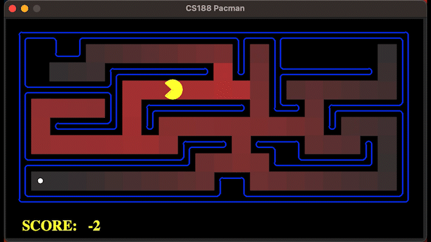
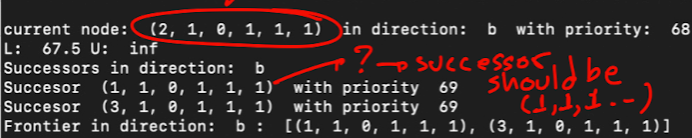

# Student Information

**Course:** COMP90054 AI Planning for Autonomy

**Semester:** Semester 1, 2023

**Student:**

Francisco Andres Reales Castro - 1279357 - frealescastr

**Collaborated with:** Janina Alica Mattes
**GitHub URL:** https://github.com/COMP90054-2023S1/assignment1-JaninaMattes

# Self Evaluation

>**Note**
> Do not exceed 500 words for each Part. This is indicative, no need to have 500 words, and it's not a strict limit.

## Part 1
#### Self Evaluated Marks (3 marks):
3
#### Code Performance
The Enforced Hill Climbing algorithm is a technique for finding the best path between two points in a deterministic domain. It is particularly useful for solving problems with local optima, where a greedy approach like hill climbing would lead to Pacman getting stuck in a locally optimal part of the maze. Thus the Enforced Hill Climbing algorithm allows Pacaman a more informed decision-making based on the heuristic, which in this case is the Manhattan distance between the current state and the goal or starting state.

##### Performance 
###### Small Maze

It is observable that Pacman moves for one action sequence into a non optimal direction where the heuristic function given doesn't provide enough information to guide Pacman into the right direction initally (Not optimal solution) leading to more node expansions.

##### Analysis Search Algorithm (Enforced Hill Climbing (EHC))
| Type of Problem | Node Expansion | Time (s)| Cost | Length of Path |
|-----------------|----------------|------|------|----------------|
| TinyMaze        | 14             | 0.00 | 8    | 8              |
| SmallMaze       | 114            | 0.00 | 39   | 39             |
| MediumMaze      | 151            | 0.00 | 76   | 76             |
| BigMaze         | 720            | 0.1  | 246  | 246            |

#### Learning and Challenges

One challenge was to translate the pseudocode into executable Python code and to correctly interpret and implement functions that are not explicitly listed in the paper, such as `extract-solution()`. A helpful method was to write the pseudo-code to pseudopython. 

#### Justification
The algorithm was well understood through the review of the given material and the individual implementation.
##### Result of the Testcases
 

## Part 2
#### Self Evaluated Marks (3 marks):
3
#### Code Performance

##### Analysis Search Algorithm (Bidirectional  A\* Enhanced (BAE\*))
| Type of Problem | Node Expansion | Time | Cost | Length of Path |
|-----------------|----------------|------|------|----------------|
| TinyMaze        | 11             | 0.00 | 8    | 8              |
| SmallMaze       | 38             | 0.00 | 19   | 19             |
| MediumMaze      | 151            | 0.00 | 76   | 76             |
| BigMaze         | 571            | 0.0  | 210  | 210            |

The implemented `BAE*` search algorithm with Manhattan heuristic can solve all given search problems in reasonable time. `BAE*` finishes the search only when it has found the optimal solution with the lowest cost from the start state to the goal state. In comparison to `EHC` less nodes are expanded in order to find a plan that can solve the problem, this because A* takes into consideration the acumulated cost g(n).

###### Medium Maze

#### Learning and Challenges
Task three presented a greater challenge, the explanation stated that upper and lower bounds are kept to determine the algorithm's termination, but it was not initially clear how it was ensuring that the returned path was optimal. Similarly, the introduction of a new term for the priority function, and the lack of definition of the function chooseDirection() increased the complexity to solve the problem. After reading the paper these details were clarified.

Then, just like in part 1, a Pseudopython was created as a steppingstone.

In the beginning, the algorithm was not expanding the same number of nodes as in the test case. For this reason, all the nodes, successors, and actions were printed to see what the program was doing and drew the path manually in a maze representation to clear up the error. After this, it was evident that the node expansion order was affecting the moment that the forward and backward paths were encountering each other. 

#### Ideas That Almost Worked Well
The <code>structure</code> of the code is primarily based on the proposed pseudo code outlined in the paper. Extensive <code>experiments</code> were therefore mainly conducted to optimize the code, such as employing more appropriate auxiliary data structures like <code>DictionaryLists</code> or restructuring the code to reduce errands and support readability.

#### Justification
The implemented <code>Planner</code> was able to solve not only local tests but also the first two hidden problems on the server, providing a complete solution path from the initial to the final state. 
##### Result of the first two testcases

Third test case failed due to a sequence that differed in a single action in the path, despite the optimal path length being found in both cases. 

Through manual analysis and debugging of the algorithm's outputs, it was observed that the node expansion is defined by the order in which nodes are removed from the open list, even if the solution for all cases is optimal. At times, all priorities in the priority queue (PQ) were identical, and simply reversing the successors enabled the test to pass. This, however, does not imply that the algorithm was not functioning correctly but rather suggests that the test cases were inflexible. Doubts with regards to finding different optimal solutions were posted on Ed.

Based on this analysis it appears that the BAE* search algorithm returns the first optimal path found while disregarding other feasible paths, which is defined through keeping track of the total path cost and comparing it against an upper bound. Consequently, if the lengths of the paths are identical to the given solution and constitute a path from the initial to the goal state, both solutions should be deemed optimal.

## Part 3
#### Self Evaluated Marks (4 marks):
4

#### Code Performance
We investigates into three solutions which are all able to solve the problem but come with different trade-offs.

##### Solution 1

###### SmallMaze

##### Analysis Solution 1: Search Algorithm (Bidirectional  A\* Enhanced (BAE\*))
| Type of Problem | Node Expansion | Time | Cost | Length of Path |
|-----------------|----------------|------|------|----------------|
| TinyMaze        | 11             | 0.00 | 8    | 8              |
| SmallMaze       | 38             | 0.00 | 19   | 19             |
| MediumMaze      | 151            | 0.00 | 76   | 76             |
| BigMaze         | 571            | 0.0  | 210  | 210            |

##### Solution 2
A secondary approach was developed to consider the state model's requirement of defining all goal states, which consist of the starting state and the goal states. After the initialization all goal states are enqueued into the priority queue. The new method involves creating a state model that encodes the coordinates `(x, y)` of the current Pacman position in the maze, with the goal states `(r_i, ..., r_n)` that need to be visited, or have already been visited depending on the direction. Upon visiting a goal state, the corresponding element is removed from the list.

Alternatively, a less computationally intensive technique involves utilizing the foodGrid 2D array, which employs Boolean values (True or False) to encode all the goal states' positions in the maze.

###### TrickySearch

##### Analysis Solution 2: Search Algorithm (Bidirectional  A\* Enhanced (BAE\*))
| Type of Problem | Node Expansion | Time | Cost | Length of Path |
|-----------------|----------------|------|------|----------------|
| SmallCorners    | 1516           | 0.1  | 83   | 83             |
| MediumCorners   | 1337           | 0.2  | 88   | 88             |
| TrickySearch    | 23376          | 17.7 | 60   | 60             |

The second version of the BAE* algorithm has been designed to handle multiple goal states, however, due to a non optimal path length in some cases it was only able to pass the `mediumCorners` test of the hidden tests on the server. 

There are several potential enhancements that can be made to the existing code. For instance, it would be advisable to substitute the tuple data structure with an auxiliary data structure such as `ListDict()` to optimize code performance. This adjustment has already been implemented, and various options have been considered and evaluated.

Moreover, to improve the results, it would be beneficial to employ an admissible and consistent heuristic that does not overestimate the actual cost to a goal state. This approach would ensure that the search algorithm generates more optimal solutions when utilizing informed search techniques.

Employing the Pacman GameState `foodGrid` into the definition of a state model can further enhance the program's efficiency. However, this approach also entails potential hazards in terms of correctly accessing information from the 2D array. Careful consideration and measures need to be taken to ensure proper handling and manipulation of the `foodGrid` data structure to avoid any erroneous outcomes.

#### Learning and Challenges
An early visualization between state space graph and search tree supported further understanding of the problem. It visualizes again that each node in the search tree represents an entire path in the state space graph. Thereby only states that are immediately worked with are stored in the frontier and successors are only computed on-demand using the corresponding successor function.

###### Learning from solution 1
In the first idea we considered that the definition of the whole state model would take into account the condition of finding `|G|` food nodes and constructing a new transition function. To this end, we formally defined the new state representation as follows:

Where x,y are the coordinates in the maze and `reachedgoal_i` is a binary value: 
It takes the value 1 if `goal_i` (first food node) has been reached already and 0 if not. 

In this example:

*  `s = [10,6,0,0,0]` means that Pacman is in coordinates `(10,6)` and has not reached any of the 3 goal states. 
* `s = [1,1,1,1,1]` means that the location is `(1,1)` and all goal states have been reached.

Thereby the transition function for updating `x,y` remains the same, but now it should be set to 1 reachedGoal_i when the goal state `i` has been found and 0 for the backward version. However, one problem that occurred with the transition function was that a visited `(x,y)` pair was also displayed in the successor states because the state was different due to the newly attached variables. After this was fixed and all outputs were shown, it was apparent that the programme was working as expected.

Another significant challenge we encountered was the need to consider multiple goals. Initially, we implemented a single goal [1,1,1,...1] that directed Pacman to find all food, but the result was always a final position of (1,1). After careful consideration and analysis, we concluded that adding all possible end coordinates (i.e., the positions of the food) to the priority queue would enable the system to function as intended. We arrived at the conclusion that the system would be functional if all possible end coordinates, which refer to the positions of the food, were added to the priority queue. The underlying concept is depicted in the following diagram.

The third challenge was to develop a heuristic to guide the search. This was defined as follows, where f, b are the two directions, `$\hat{x}$` is the negation of a binary vector `x` (or multihot encoding), and `‖y-z‖` is the distance between y and z, using a given distance metric.

For the local and hidden tests, the proposed heuristic was used with Manhattan distance as metric. Passing the local test and 3/4 hidden tests. 

#### Heuristic Functions
To better understand the problematic with the third hidden testcase, different Heuristics were compared for multiple maze layers, the proposed heuristic is named `(r_g*distanceMetric)`. The table Highlights in red the solutions that were not optimal. 

The strength of this heuristic lays in finding the optimal path in a short time for most cases. However, it did not provide an optimal solution for tiny searches or for `testcase 4`. 

We came to the conclusion that the algorithm was not finding the optimal path due to the heuristic's lack of admissibility - the heuristic was overestimating the true cost to reach the goals. By multiplying the heuristic by a constant weight of `w=0.5`, the path found by the search algorithm for the tiny search with the heuristic `wr_gManhattan` is optimal but requires twice as many nodes to be expanded.

#### Ideas That Almost Worked Well

The problem at hand bears similarities to the NP-hard Travelling Salesman problem, which involves finding the shortest possible route that connects all nodes without cycles and with the lowest total weight of edges. Initially, a programmatic approach was considered without accounting for changes in the problem state model or definition. This approach involved an outer loop that would greedily select the next best goal state based on an approximate distance between the current starting state and the next best goal state. However, it was discovered that this approach did not result in an optimal solution as it assumed that the closest next node always follows the shortest path, which may not always be the case. Additionally, this approach would have required altering the search algorithm code, which would have reduced its generalizability. As a result, the idea of breaking the total path down into path segments and subsequently collecting them into a solution path was discarded.

#### Justification
We successfully achieved the primary objective of this task, which involved developing the algorithm, state model, and heuristic functions. Despite facing significant obstacles, we were able to overcome them and gain a better understanding of the problem by examining various perspectives and solutions.

